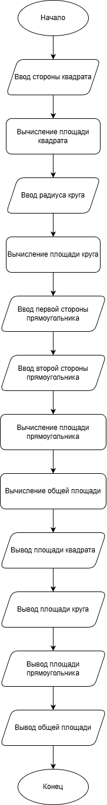

# Отчет по лабораторной работе №1
# Императивное (процедурное) программирование

**Дата:** 03-12-2025  
**Семестр:** 2 курс, 1 семестр  
**Группа:** ПИН-Б-О-24-2  
**Дисциплина:** Технологии программирования  
**Студент:** Осипов Александр Сергеевич

## Цель работы

Познакомиться с особенностями процедурного программирования. Решить задания в процедурном стиле. Составить отчет.

## Теоретическая часть

Процедурное программирование - это парадигма программирования, в которой выполнение программы сводится к последовательному выполнению операторов с целью преобразования исходного состояния памяти в заключительное состояние (результаты).

**Основные особенности:**
- Последовательное выполнение операторов
- Использование переменных для хранения данных
- Организация кода в процедуры и функции
- Явное управление памятью
- Декомпозиция задач на шаги

**Основные понятия:**
- **Переменная** - состоит из имени и выделенной области памяти
- **Функция** - подпрограмма, принимающая параметры и возвращающая результат
- **Процедура** - именованная часть программы для выполнения действий

## Практическая часть

### Выполненные задачи

- [x] Задача 1: Написать программу расчета площадей трех фигур (квадрат, прямоугольник, круг)
- [x] Задача 2: Разобрать ассемблерный код и реализовать алгоритм на R

### Задание 1: Программа расчета площадей фигур

#### Псевдокод

```
Начало программы
Запросить сторону квадрата
Вычислить площадь квадрата = сторона * сторона
Запросить радиус круга
Вычислить площадь круга = 3.14159 * радиус * радиус
Запросить первую сторону прямоугольника
Запросить вторую сторону прямоугольника
Вычислить площадь прямоугольника = первая_сторона * вторая_сторона
Вычислить общую площадь = площадь_квадрата + площадь_круга + площадь_прямоугольника
Вывести площадь квадрата
Вывести площадь круга
Вывести площадь прямоугольника
Вывести общую площадь
Конец программы
```

#### Блок-схема



#### Код программы

```r
# Запрос данных о квадрате
square_side <- as.numeric(readline("Введите сторону квадрата: "))

# Вычисление площади квадрата
square_area <- square_side * square_side

# Запрос данных о круге
circle_radius <- as.numeric(readline("Введите радиус круга: "))

# Вычисление площади круга
circle_area <- pi * circle_radius * circle_radius

# Запрос данных о прямоугольнике
rectangle_side1 <- as.numeric(readline("Введите первую сторону прямоугольника: "))
rectangle_side2 <- as.numeric(readline("Введите вторую сторону прямоугольника: "))

# Вычисление площади прямоугольника
rectangle_area <- rectangle_side1 * rectangle_side2

# Вычисление общей площади
total_area <- square_area + circle_area + rectangle_area

# Вывод результатов
cat("Площадь квадрата:", square_area, "\n")
cat("Площадь круга:", circle_area, "\n")
cat("Площадь прямоугольника:", rectangle_area, "\n")
cat("Общая площадь:", total_area, "\n")
```

#### Результаты выполнения

Пример работы программы:

```
Введите сторону квадрата: 5
Введите радиус круга: 3
Введите первую сторону прямоугольника: 4
Введите вторую сторону прямоугольника: 6
Площадь квадрата: 25
Площадь круга: 28.27433
Площадь прямоугольника: 24
Общая площадь: 77.27433
```

### Задание 2: Анализ ассемблерного кода

#### Псевдокод функции foo

```
Начало функции foo(параметр n)
  Если n > 0, то:
    Сохранить n в стеке
    Уменьшить n на 1
    Вызвать foo(n-1) рекурсивно
    Восстановить n из стека
    Умножить результат на n
    Вернуть результат
  Иначе:
    Вернуть 1
Конец функции
```

#### Описание алгоритма

Данная функция вычисляет факториал числа. Если входной параметр <= 0, возвращается 1. Если входной параметр > 0, функция рекурсивно вызывает себя с параметром (n-1), затем умножает результат на n.

#### Ответ на вопрос

**Что будет получено при передаче функции числа 7?**

При передаче числа 7 функция вернет **7! (факториал 7) = 5040**

Вычисление:
- foo(7) = 7 * foo(6) = 7 * 720 = **5040**
- foo(6) = 6 * foo(5) = 6 * 120 = 720
- foo(5) = 5 * foo(4) = 5 * 24 = 120
- foo(4) = 4 * foo(3) = 4 * 6 = 24
- foo(3) = 3 * foo(2) = 3 * 2 = 6
- foo(2) = 2 * foo(1) = 2 * 1 = 2
- foo(1) = 1 * foo(0) = 1 * 1 = 1
- foo(0) = 1

#### Реализация на R

```r
foo <- function(n) {
  if (n > 0) {
    # Рекурсивный вызов с уменьшенным параметром
    result <- foo(n - 1)
    # Умножение результата на текущее значение n
    return(n * result)
  } else {
    # Базовый случай: возвращаем 1
    return(1)
  }
}
```

#### Результаты выполнения

```
foo(0) = 1
foo(1) = 1
foo(2) = 2
foo(3) = 6
foo(4) = 24
foo(5) = 120
foo(6) = 720
foo(7) = 5040
```

## Результаты выполнения

### Тестирование

- [x] Программа корректно вычисляет площади фигур
- [x] Функция факториала работает правильно для всех тестовых значений
- [x] Код соответствует процедурному стилю программирования

## Выводы

1. Процедурное программирование позволяет четко структурировать программу как последовательность операторов
2. Использование функций и процедур упрощает организацию кода и его повторное использование
3. Рекурсивные функции позволяют элегантно решать задачи, которые естественно описываются рекурсивно
4. Процедурный стиль обеспечивает простоту понимания и отладки программ

## Ответы на контрольные вопросы

### 1. Особенности процедурного программирования

Процедурное программирование характеризуется следующими особенностями:

- **Последовательное выполнение**: Программа выполняется последовательно, оператор за оператором, с целью преобразования исходного состояния памяти в заключительное состояние (результаты).

- **Процедуры и функции**: Код может быть организован в отдельные блоки - процедуры и функции, которые можно вызывать многократно из разных частей программы.

- **Управление памятью**: Программист явно определяет, как программа работает с памятью, создавая переменные и управляя их значениями.

- **Декомпозиция задач**: Задачи разбиваются на шаги и решаются шаг за шагом.

- **Простота понимания**: Логика программы следует линейной структуре, что облегчает понимание и отладку.

### 2. Линейная программа

Линейная программа - это программа, в которой команды выполняются последовательно, одна за другой, без использования условных переходов и циклов. Структура линейной программы:

```
Начало программы
Команда 1
Команда 2
...
Команда N
Конец программы
```

В линейной программе нет ветвлений и циклов, все команды выполняются строго в порядке их написания.

### 3. Понятия: переменная, процедура, функция

**Переменная** - состоит из имени и выделенной области памяти, которая соответствует ей. Переменная используется для хранения данных, которые могут изменяться в процессе выполнения программы.

**Процедура** - это независимая именованная часть программы, которую после однократного описания можно многократно вызвать по имени из последующих частей программы для выполнения определенных действий. Процедура не возвращает значение.

**Функция** - это подпрограмма специального вида, которая может принимать на вход параметры, выполнять различные действия и передавать результаты работы. Вызов функции является выражением и может использоваться в других выражениях или в качестве правой части присваивания.

### 4. Безусловный оператор

Безусловный оператор (goto, jmp) - оператор перехода, который позволяет перейти к определенной метке в программе без проверки условий. Оператор состоит из двух частей: собственно оператора и метки, указывающей целевую точку перехода.

**Особенности:**
- Метка может быть числом или идентификатором
- После выполнения оператора goto выполнение программы продолжается с команды, помеченной меткой
- Использование безусловных переходов может привести к созданию "спагетти-кода" - программы с запутанной структурой

В структурном программировании использование goto не рекомендуется, так как это усложняет понимание и поддержку кода.

## Приложения

- Исходный код: `project/lab01_zadanie1.R`, `project/lab01_zadanie2.R`
- Задание: `task.md`

