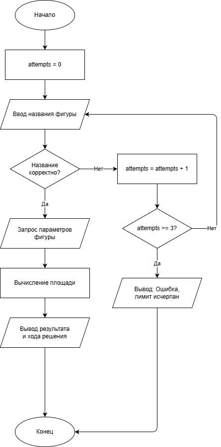
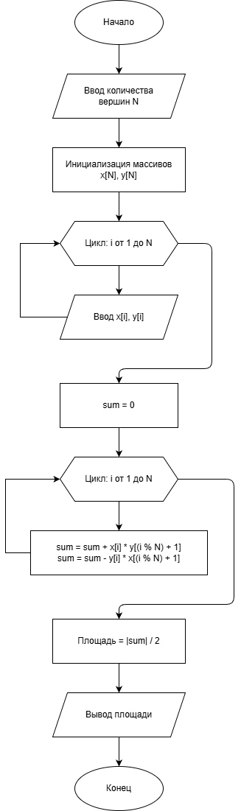

# Отчет по лабораторной работе №2
# Структурное программирование

**Дата:** 03-12-2025  
**Семестр:** 2 курс, 1 семестр  
**Группа:** ПИН-Б-О-24-2  
**Дисциплина:** Технологии программирования  
**Студент:** Осипов Александр Сергеевич

## Цель работы

Познакомиться с особенностями структурного программирования. Решить задания в структурном стиле. Составить отчет.

## Теоретическая часть

Структурное программирование - методология разработки программного обеспечения, в основе которой лежит представление программы в виде иерархической структуры блоков. В соответствии с данной методологией любая программа строится без использования оператора goto из трех базовых управляющих структур: последовательность, ветвление, цикл; кроме того, используются подпрограммы.

**Теорема Бёма - Якопини** утверждает, что любой исполняемый алгоритм может быть преобразован к структурированному виду, используя только три структуры управления: последовательную, ветвлений и повторов.

## Практическая часть

### Выполненные задачи

- [x] Задача 1: Программа расчета площади фигур с проверкой ввода
- [x] Задача 2: Программа расчета площади многоугольника

### Задание 1: Программа расчета площади фигур

#### Блок-схема



#### Код программы

```r
# Список допустимых фигур для варианта 1
valid_figures <- c("треугольник", "квадрат", "прямоугольник", "параллелограмм")

# Счетчик попыток
attempts <- 0
max_attempts <- 3

# Флаг для выхода из цикла
figure_found <- FALSE

# Цикл запроса названия фигуры
while (!figure_found && attempts < max_attempts) {
  # Запрос названия фигуры
  figure_name <- tolower(readline("Введите название фигуры: "))
  
  # Проверка корректности названия
  if (figure_name %in% valid_figures) {
    figure_found <- TRUE
    
    # Обработка различных фигур
    if (figure_name == "треугольник") {
      base <- as.numeric(readline("Введите основание треугольника: "))
      height <- as.numeric(readline("Введите высоту треугольника: "))
      area <- 0.5 * base * height
      cat("\n=== РЕЗУЛЬТАТ ===\n")
      cat("Фигура: Треугольник\n")
      cat("Формула: Площадь = 0.5 * основание * высота\n")
      cat("Площадь треугольника:", area, "\n")
    }
    # ... аналогично для других фигур
  } else {
    attempts <- attempts + 1
    if (attempts < max_attempts) {
      cat("Некорректное название. Осталось попыток:", max_attempts - attempts, "\n")
    } else {
      cat("Некорректность действий пользователя. Программа завершается.\n")
    }
  }
}
```

#### Результаты выполнения

```
Введите название фигуры: квадрат
Введите сторону квадрата: 5

=== РЕЗУЛЬТАТ ===
Фигура: Квадрат
Сторона: 5
Формула: Площадь = сторона * сторона
Площадь квадрата: 25
```

### Задание 2: Программа расчета площади многоугольника

#### Блок-схема



#### Код программы

```r
# Ввод количества вершин
N <- as.integer(readline("Введите количество вершин многоугольника: "))

# Инициализация массивов для координат
x <- numeric(N)
y <- numeric(N)

# Ввод координат вершин
for (i in 1:N) {
  x[i] <- as.numeric(readline(paste("Введите x координату вершины", i, ": ")))
  y[i] <- as.numeric(readline(paste("Введите y координату вершины", i, ": ")))
}

# Вычисление площади по формуле шнурков Гаусса
sum_area <- 0
for (i in 1:N) {
  next_i <- ifelse(i == N, 1, i + 1)
  sum_area <- sum_area + (x[i] * y[next_i] - x[next_i] * y[i])
}

# Вычисление площади
area <- abs(sum_area) / 2

# Вывод результата
cat("Площадь многоугольника:", area, "\n")
```

#### Результаты выполнения

```
Введите количество вершин многоугольника: 4
Введите x координату вершины 1: 0
Введите y координату вершины 1: 0
Введите x координату вершины 2: 4
Введите y координату вершины 2: 0
Введите x координату вершины 3: 4
Введите y координату вершины 3: 3
Введите x координату вершины 4: 0
Введите y координату вершины 4: 3

Площадь многоугольника: 12
```

## Результаты выполнения

### Тестирование

- [x] Программа корректно обрабатывает ввод названий фигур
- [x] Программа ограничивает количество попыток ввода
- [x] Программа правильно вычисляет площади фигур
- [x] Программа корректно вычисляет площадь многоугольника по формуле Гаусса

## Выводы

1. Структурное программирование позволяет создавать программы без использования оператора goto
2. Использование циклов и условий обеспечивает четкую структуру программы
3. Проверка ввода данных повышает надежность программы
4. Формула шнурков Гаусса эффективна для вычисления площади многоугольников

## Ответы на контрольные вопросы

### 1. Особенности структурного программирования

Структурное программирование основано на:
- Иерархической структуре блоков
- Трех базовых управляющих структурах: последовательность, ветвление, цикл
- Использовании подпрограмм
- Методе разработки "сверху вниз"
- Отказе от оператора goto

### 2. Теорема Бёма - Якопини

Теорема утверждает, что **любой исполняемый алгоритм может быть преобразован к структурированному виду**, используя только три структуры управления: последовательную, ветвлений и повторов. Это математически обосновывает возможность отказа от оператора goto.

### 3. Пропуск итерации и досрочный выход из цикла

**Досрочный выход (break)**: Прерывает выполнение цикла, когда условие выхода еще не достигнуто. В R используется оператор `break`.

**Пропуск итерации (next)**: Пропускает текущую итерацию цикла, но цикл продолжается. В R используется оператор `next`.

## Приложения

- Исходный код: `project/zadanie1.R`, `project/zadanie2.R`
- Задание: `task.md`

