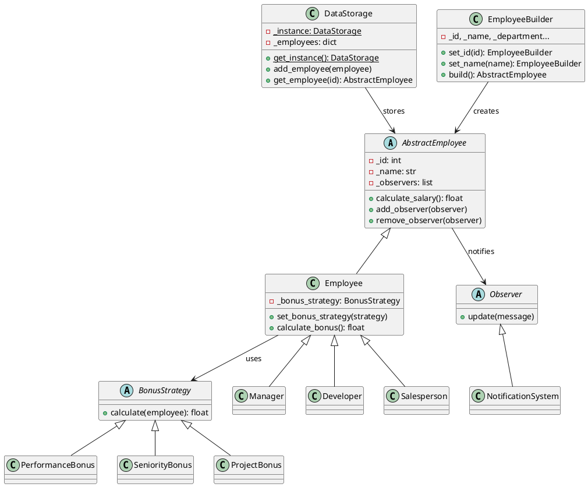

# Отчет по лабораторной работе №5
# Применение паттернов проектирования

**Дата:** 21-12-2025  
**Семестр:** 2 курс, 1 семестр  
**Группа:** ПИН-Б-О-24-2  
**Дисциплина:** Технологии программирования  
**Студент:** Осипов Александр Сергеевич

## Цель работы

Освоить практическое применение паттернов проектирования для рефакторинга системы учета сотрудников из ЛР №4.

## Теоретическая часть

Паттерны проектирования - типовые решения часто встречающихся проблем в ООП. В работе реализованы:

1. **Singleton** (порождающий) - гарантирует единственный экземпляр класса
2. **Builder** (порождающий) - пошаговое создание сложных объектов
3. **Strategy** (поведенческий) - определяет семейство алгоритмов и делает их взаимозаменяемыми
4. **Observer** (поведенческий) - определяет зависимость один-ко-многим между объектами

## Практическая часть

### Структура проекта

```
lab05/
├── project/
│   ├── models/
│   │   ├── abstract_employee.py
│   │   ├── employee.py
│   │   ├── manager.py
│   │   ├── developer.py
│   │   └── salesperson.py
│   ├── patterns/
│   │   ├── singleton.py
│   │   ├── builder.py
│   │   ├── strategy.py
│   │   └── observer.py
│   └── main.py
└── ОТЧЕТ.md
```

### Выполненные задачи

- [x] Singleton - класс DataStorage для хранения данных
- [x] Builder - класс EmployeeBuilder для создания сотрудников
- [x] Strategy - стратегии расчета бонусов (PerformanceBonus, SeniorityBonus, ProjectBonus)
- [x] Observer - система уведомлений NotificationSystem

### Ключевые фрагменты кода

**1. Singleton (DataStorage)**

```python
class DataStorage:
    _instance = None

    def __new__(cls):
        if cls._instance is None:
            cls._instance = super().__new__(cls)
            cls._instance._employees = {}
        return cls._instance

    @classmethod
    def get_instance(cls):
        if cls._instance is None:
            cls._instance = cls()
        return cls._instance
```

**2. Builder (EmployeeBuilder)**

```python
class EmployeeBuilder:
    def set_id(self, emp_id: int):
        self._id = emp_id
        return self

    def set_name(self, name: str):
        self._name = name
        return self

    def build(self):
        if self._type == "developer":
            return Developer(self._id, self._name, ...)
        return Employee(self._id, self._name, ...)
```

**3. Strategy (BonusStrategy)**

```python
class BonusStrategy(ABC):
    @abstractmethod
    def calculate(self, employee) -> float:
        pass

class PerformanceBonus(BonusStrategy):
    def __init__(self, percent: float = 0.1):
        self._percent = percent

    def calculate(self, employee) -> float:
        return employee.base_salary * self._percent
```

**4. Observer (NotificationSystem)**

```python
class Observer(ABC):
    @abstractmethod
    def update(self, message: str):
        pass

class NotificationSystem(Observer):
    def update(self, message: str):
        self._messages.append(message)
        print(f"[{self._name}] {message}")
```

## Результаты выполнения

### Пример работы программы

```
============================================================
ЛАБОРАТОРНАЯ РАБОТА №5
Применение паттернов проектирования
============================================================

============================================================
1. ПАТТЕРН SINGLETON
============================================================
storage1 is storage2: True
ID storage1: 2151433994768
ID storage2: 2151433994768
[Storage] Добавлен: Иван Петров
Найден через storage2: Иван Петров

============================================================
2. ПАТТЕРН BUILDER
============================================================
Создан: Сотрудник [id: 1, Анна Сидорова, HR, зп: 40000], итого: 40000.0
Создан: Разработчик [id: 2, Петр Иванов, Разработка, зп: 60000], senior, навыки: [Python, SQL, Docker], итого: 120000.0
Создан: Менеджер [id: 3, Мария Козлова, Управление, зп: 80000], бонус: 15000, итого: 95000.0

============================================================
3. ПАТТЕРН STRATEGY
============================================================
Сотрудник: Анна Сидорова, базовая зп: 40000
Стратегия PerformanceBonus (10%): бонус = 4000.0
  Итоговая зп: 44000.0
Стратегия SeniorityBonus (3 года): бонус = 6000
  Итоговая зп: 46000
Стратегия ProjectBonus: бонус = 10000
  Итоговая зп: 50000

============================================================
4. ПАТТЕРН OBSERVER
============================================================
Сотрудник Петр Иванов подписан на уведомления
Меняем зарплату...
[HR-отдел] Зарплата сотрудника Петр Иванов изменена: 60000 -> 75000
[Email -> boss@company.ru] Зарплата сотрудника Петр Иванов изменена: 60000 -> 75000

============================================================
ДЕМОНСТРАЦИЯ ЗАВЕРШЕНА
============================================================
```

## Сравнение: до и после применения паттернов

| Аспект | До (ЛР №2) | После (ЛР №5) |
|--------|------------|---------------|
| Создание объектов | Прямой вызов конструктора | Builder с fluent-интерфейсом |
| Хранение данных | Локальные переменные | Singleton DataStorage |
| Расчет бонусов | Жестко в классах | Взаимозаменяемые Strategy |
| Уведомления | Отсутствуют | Observer с подпиской |

## Анализ паттернов

| Паттерн | Плюсы | Минусы |
|---------|-------|--------|
| Singleton | Единая точка доступа, контроль экземпляра | Глобальное состояние, сложно тестировать |
| Builder | Гибкое создание объектов, читаемый код | Дополнительный класс |
| Strategy | Легко добавлять алгоритмы, нет условных операторов | Много классов |
| Observer | Слабая связанность, динамическая подписка | Порядок уведомлений не гарантирован |

## Выводы

1. Реализованы 4 паттерна проектирования: Singleton, Builder, Strategy, Observer
2. Паттерны улучшили гибкость и расширяемость системы
3. Код стал более структурированным и поддерживаемым
4. Паттерны можно комбинировать для решения сложных задач

## UML-диаграмма классов



## Приложения

- Исходный код: `project/`
- UML-диаграмма: см. выше
